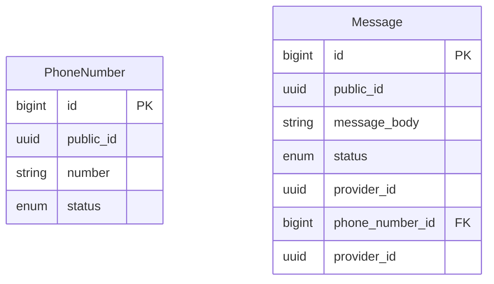

# Texting service 

The purpose of this API is to receive a message and sen send it with external SMS service providers. It has a simple and
straightforward load balancer to equally distribute the load between providers. It also has a simple retry mechanism
implemented with Sidekiq.
 


## Setup and run

This application uses [Docker Compose](https://docs.docker.com/compose/) for services. The idea is that a rails app is 
running locally, but all the services are running in containers. Setup and startup process is automated with `Makefile`
and [Foreman](https://github.com/theforeman/foreman).

To setup, install docker, then run
```shell
  make build
```

To run the application
```shell
  make up
```

Or if you want to run it in separate terminal tabs
```shell
  docker-compose up
  bin/dev
```
## 


## Run tests

```shell
  rails test
```


